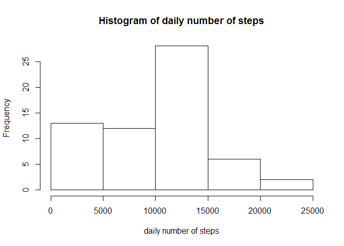

# Reproducible Research: Peer Assessment 1


## Loading and preprocessing the data
Firstly we check the working directory (and switch it if necessary) and unzip the data file. Thereafter we read the csv into the data frame 


```r
getwd()
```

```
## [1] "C:/Users/maks/Documents/GitHub/RepData_PeerAssessment1"
```

```r
#setwd()
file = unzip("activity.zip")
data_original = read.csv("activity.csv")
```


The dataset contains 3 variables <code>steps, data, interval</code> which we do not transform at this stage.


## What is mean total number of steps taken per day?
Despite the large  amount of observations (17568), the dataset contains information related to only 61 days as we can see by running the following code


```r
print(unique(data_original$date))
```

```
##  [1] 2012-10-01 2012-10-02 2012-10-03 2012-10-04 2012-10-05 2012-10-06
##  [7] 2012-10-07 2012-10-08 2012-10-09 2012-10-10 2012-10-11 2012-10-12
## [13] 2012-10-13 2012-10-14 2012-10-15 2012-10-16 2012-10-17 2012-10-18
## [19] 2012-10-19 2012-10-20 2012-10-21 2012-10-22 2012-10-23 2012-10-24
## [25] 2012-10-25 2012-10-26 2012-10-27 2012-10-28 2012-10-29 2012-10-30
## [31] 2012-10-31 2012-11-01 2012-11-02 2012-11-03 2012-11-04 2012-11-05
## [37] 2012-11-06 2012-11-07 2012-11-08 2012-11-09 2012-11-10 2012-11-11
## [43] 2012-11-12 2012-11-13 2012-11-14 2012-11-15 2012-11-16 2012-11-17
## [49] 2012-11-18 2012-11-19 2012-11-20 2012-11-21 2012-11-22 2012-11-23
## [55] 2012-11-24 2012-11-25 2012-11-26 2012-11-27 2012-11-28 2012-11-29
## [61] 2012-11-30
## 61 Levels: 2012-10-01 2012-10-02 2012-10-03 2012-10-04 ... 2012-11-30
```

Therefore we create a new dataset <code>total_number</code> which contains only 61 rows with the total amount of steps for each day. We ignore observations with missing steps.

```r
total_number = aggregate(data_original$steps, by=list(data_original$date), FUN = sum, na.rm = TRUE)
```

The histogram shows that the distribution is far from the normal distribution which is due to the fact that many observations are missed.


```r
hist(total_number$x, xlab = 'daily number of steps', main ='Histogram of daily number of steps')
```

<!-- -->


The mean value of steps is 9354,22 whereas the median is 10395. We computed these values by means of the following commands


```r
mean(total_number$x, na.rm = TRUE )
```

```
## [1] 9354.23
```

```r
median(total_number$x, na.rm = TRUE)
```

```
## [1] 10395
```


## What is the average daily activity pattern?

After the exploration of the daily information we want to understand how the activity depends on time interval (or in other words on time). To this end we create the new dataset <code>average_number</code> containing information about the average number of steps for each time period


```r
average_number = aggregate(data_original$steps, by=list(data_original$interval), FUN = mean, na.rm = TRUE)
```


where again we ignored missing values. 

The scatter plot shows that there is an activity peak which probably corresponds to the beginning of the day, when majority of people have a jog. 


```r
plot(average_number$Group.1, average_number$x, type = "l", xlab = 'time interval', ylab = 'average number of steps')
```

<!-- -->

The time interval corresponding to the activity peak is equal to 835

```r
subset(average_number, x == max(average_number$x)) 
```

```
##     Group.1        x
## 104     835 206.1698
```


## Imputing missing values
However, our analysis is incomplete because we exclude from the consideration missing values. To estimate its importance we firstly compute the fraction of obserations with missing values 


```r
sum(is.na(data_original$steps))/length(data_original$steps)
```

```
## [1] 0.1311475
```
More than 13% of observations are missed. This can lead to potentially wrong predictions, therefore we need to input some values instead of the missing values. The most obvious way is to replace missing values with the mean number of steps performed during the corresponding time interval. However, we apply more elaborated technique called *multiple imputation* which is an iterative process of probabilistic stimation of missing values based on avaliable information in the dataset. This is done with the R package *mice*


```r
library(mice)

imputed_data= mice(data_original, m=5, maxit = 50, method = 'pmm', seed = 500)
```

```
## 
##  iter imp variable
##   1   1  steps
##   1   2  steps
##   1   3  steps
##   1   4  steps
##   1   5  steps
##   2   1  steps
##   2   2  steps
##   2   3  steps
##   2   4  steps
##   2   5  steps
##   3   1  steps
##   3   2  steps
##   3   3  steps
##   3   4  steps
##   3   5  steps
##   4   1  steps
##   4   2  steps
##   4   3  steps
##   4   4  steps
##   4   5  steps
##   5   1  steps
##   5   2  steps
##   5   3  steps
##   5   4  steps
##   5   5  steps
##   6   1  steps
##   6   2  steps
##   6   3  steps
##   6   4  steps
##   6   5  steps
##   7   1  steps
##   7   2  steps
##   7   3  steps
##   7   4  steps
##   7   5  steps
##   8   1  steps
##   8   2  steps
##   8   3  steps
##   8   4  steps
##   8   5  steps
##   9   1  steps
##   9   2  steps
##   9   3  steps
##   9   4  steps
##   9   5  steps
##   10   1  steps
##   10   2  steps
##   10   3  steps
##   10   4  steps
##   10   5  steps
##   11   1  steps
##   11   2  steps
##   11   3  steps
##   11   4  steps
##   11   5  steps
##   12   1  steps
##   12   2  steps
##   12   3  steps
##   12   4  steps
##   12   5  steps
##   13   1  steps
##   13   2  steps
##   13   3  steps
##   13   4  steps
##   13   5  steps
##   14   1  steps
##   14   2  steps
##   14   3  steps
##   14   4  steps
##   14   5  steps
##   15   1  steps
##   15   2  steps
##   15   3  steps
##   15   4  steps
##   15   5  steps
##   16   1  steps
##   16   2  steps
##   16   3  steps
##   16   4  steps
##   16   5  steps
##   17   1  steps
##   17   2  steps
##   17   3  steps
##   17   4  steps
##   17   5  steps
##   18   1  steps
##   18   2  steps
##   18   3  steps
##   18   4  steps
##   18   5  steps
##   19   1  steps
##   19   2  steps
##   19   3  steps
##   19   4  steps
##   19   5  steps
##   20   1  steps
##   20   2  steps
##   20   3  steps
##   20   4  steps
##   20   5  steps
##   21   1  steps
##   21   2  steps
##   21   3  steps
##   21   4  steps
##   21   5  steps
##   22   1  steps
##   22   2  steps
##   22   3  steps
##   22   4  steps
##   22   5  steps
##   23   1  steps
##   23   2  steps
##   23   3  steps
##   23   4  steps
##   23   5  steps
##   24   1  steps
##   24   2  steps
##   24   3  steps
##   24   4  steps
##   24   5  steps
##   25   1  steps
##   25   2  steps
##   25   3  steps
##   25   4  steps
##   25   5  steps
##   26   1  steps
##   26   2  steps
##   26   3  steps
##   26   4  steps
##   26   5  steps
##   27   1  steps
##   27   2  steps
##   27   3  steps
##   27   4  steps
##   27   5  steps
##   28   1  steps
##   28   2  steps
##   28   3  steps
##   28   4  steps
##   28   5  steps
##   29   1  steps
##   29   2  steps
##   29   3  steps
##   29   4  steps
##   29   5  steps
##   30   1  steps
##   30   2  steps
##   30   3  steps
##   30   4  steps
##   30   5  steps
##   31   1  steps
##   31   2  steps
##   31   3  steps
##   31   4  steps
##   31   5  steps
##   32   1  steps
##   32   2  steps
##   32   3  steps
##   32   4  steps
##   32   5  steps
##   33   1  steps
##   33   2  steps
##   33   3  steps
##   33   4  steps
##   33   5  steps
##   34   1  steps
##   34   2  steps
##   34   3  steps
##   34   4  steps
##   34   5  steps
##   35   1  steps
##   35   2  steps
##   35   3  steps
##   35   4  steps
##   35   5  steps
##   36   1  steps
##   36   2  steps
##   36   3  steps
##   36   4  steps
##   36   5  steps
##   37   1  steps
##   37   2  steps
##   37   3  steps
##   37   4  steps
##   37   5  steps
##   38   1  steps
##   38   2  steps
##   38   3  steps
##   38   4  steps
##   38   5  steps
##   39   1  steps
##   39   2  steps
##   39   3  steps
##   39   4  steps
##   39   5  steps
##   40   1  steps
##   40   2  steps
##   40   3  steps
##   40   4  steps
##   40   5  steps
##   41   1  steps
##   41   2  steps
##   41   3  steps
##   41   4  steps
##   41   5  steps
##   42   1  steps
##   42   2  steps
##   42   3  steps
##   42   4  steps
##   42   5  steps
##   43   1  steps
##   43   2  steps
##   43   3  steps
##   43   4  steps
##   43   5  steps
##   44   1  steps
##   44   2  steps
##   44   3  steps
##   44   4  steps
##   44   5  steps
##   45   1  steps
##   45   2  steps
##   45   3  steps
##   45   4  steps
##   45   5  steps
##   46   1  steps
##   46   2  steps
##   46   3  steps
##   46   4  steps
##   46   5  steps
##   47   1  steps
##   47   2  steps
##   47   3  steps
##   47   4  steps
##   47   5  steps
##   48   1  steps
##   48   2  steps
##   48   3  steps
##   48   4  steps
##   48   5  steps
##   49   1  steps
##   49   2  steps
##   49   3  steps
##   49   4  steps
##   49   5  steps
##   50   1  steps
##   50   2  steps
##   50   3  steps
##   50   4  steps
##   50   5  steps
```

```r
data_imputed = data_original
data_imputed$steps = as.numeric(complete(imputed_data)$steps)
```
where we created a new dataset <code>data_imputed</code> identical to the original one with replaced missing values. 

Then similarly to procedures above we plot the histogram of total steps during a day and the scatter plot which shows activity during time intervals. However, this analysis is performed based on the new dataset without missing values. 


```r
total_number_imputed = aggregate(data_imputed$steps, by=list(data_imputed$date), FUN = sum, na.rm = TRUE)

hist(total_number_imputed$x,  xlab = 'daily number of steps', main ='Histogram of daily number of steps')
```

<!-- -->

The new histogram is much closer to the normal distribution than the previous one. The mean and median number of daily steps can be computed as follows

.

```r
mean(total_number_imputed$x)
```

```
## [1] 10399.89
```

```r
median(total_number_imputed$x)
```

```
## [1] 10439
```

and their values are much closer to each other than above.

The scatter plot of the average activity during time periods is also slightly different from the previous one. However, still there is a peak of activity 


```r
average_number_imputed = aggregate(data_imputed$steps, by=list(data_imputed$interval), FUN = mean)

plot(average_number_imputed$Group.1, average_number_imputed$x, type = "l", xlab = 'time interval', ylab = 'average number of steps')
```

<!-- -->


The time interval corresponding to the activity peak is the same as before the imputation and equal to 835

```r
subset(average_number_imputed, x == max(average_number_imputed$x)) 
```

```
##     Group.1        x
## 104     835 179.1311
```


## Are there differences in activity patterns between weekdays and weekends?

Finally, we would like to observe whether there is a difference between weekday and weeekenc activity. To explore this we create the new factor variable <code>wDay</code> which is TRUE for weekdays and is FALSE for weekends 


```r
Sys.setlocale("LC_ALL","English")
```

```
## [1] "LC_COLLATE=English_United States.1252;LC_CTYPE=English_United States.1252;LC_MONETARY=English_United States.1252;LC_NUMERIC=C;LC_TIME=English_United States.1252"
```

```r
weekdays1 <- c('Monday', 'Tuesday', 'Wednesday', 'Thursday', 'Friday')
#weekdays(as.Date(data_original$date))
data_imputed$wDay = factor((weekdays(as.Date(data_imputed$date)) %in% weekdays1), levels=c(FALSE, TRUE), labels=c('weekend', 'weekday')) 
```
      
      


Then we plot average activity for weekdays and weekends


```r
data_weekdays = subset(data_imputed, wDay == "weekday")
data_weekends = subset(data_imputed, wDay == "weekend")

average_number_weekday = aggregate(data_weekdays$steps, by=list(data_weekdays$interval), FUN = mean, na.rm = TRUE)

average_number_weekend = aggregate(data_weekends$steps, by=list(data_weekends$interval), FUN = mean, na.rm = TRUE)
```


There is a difference in activity during working days and weekends. During the weekdays the peak of activity arise at certain time interval (most ptobably before work), whereas during weekends there more peaks but of smallar magnitude, This can be explained that during weekend people can go for a jog at any time of the day (in contrast to weekdays). However, it seems that people prefer to go for a jog at the beginning of every hour which explained small peaks during weekends.


```r
par(mfrow=c(2,1))
plot(average_number_weekday$Group.1, average_number_weekday$x, type = "l", xlab = 'time interval', ylab = 'average number of steps',  main =  'average number os steps during weekdays')


plot(average_number_weekend$Group.1, average_number_weekend$x, type = "l",  xlab = 'time interval', ylab = 'average number of steps', main =  'average number os steps during weekends')
```

<!-- -->


         

